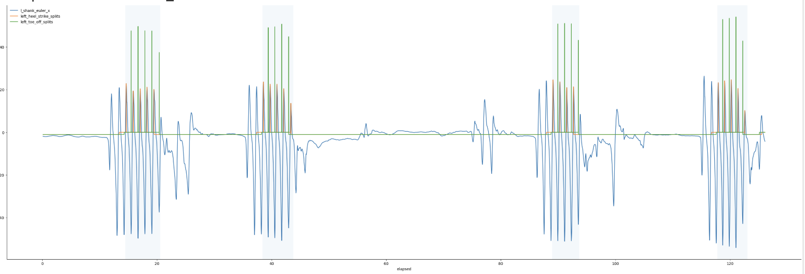
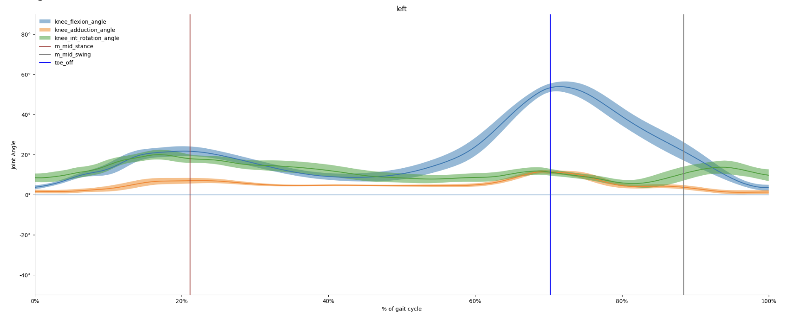
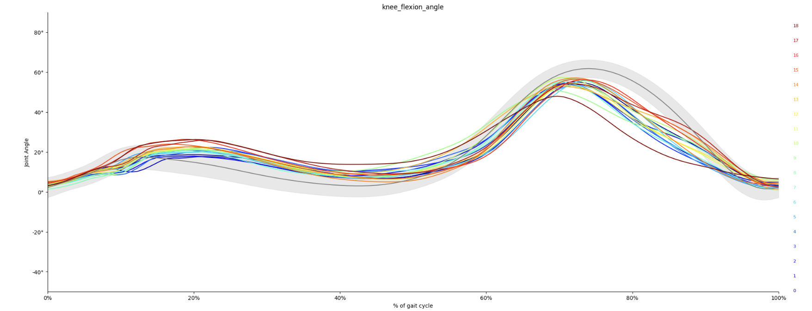
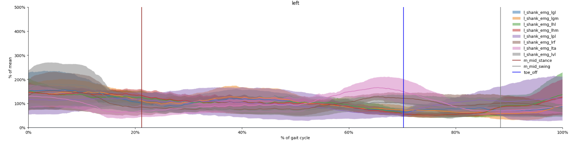
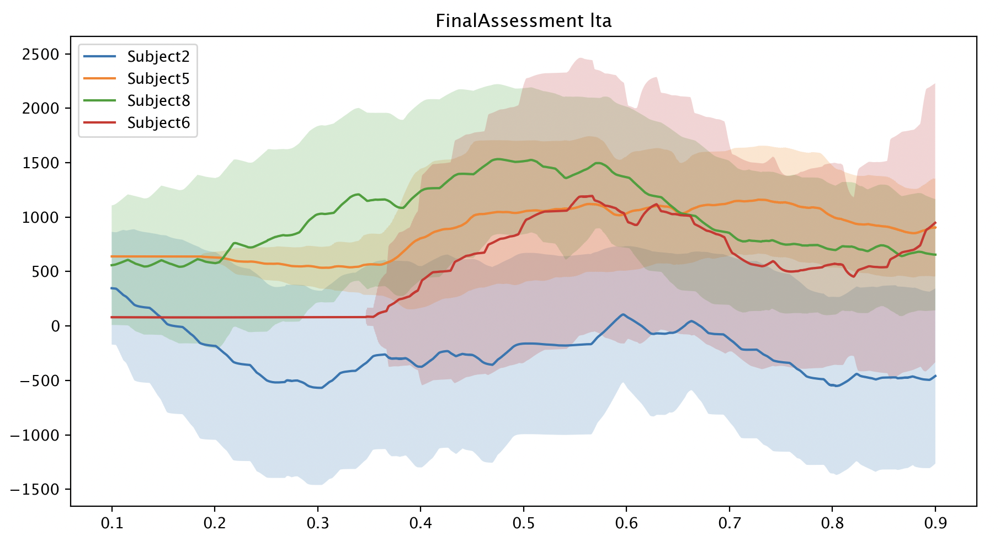
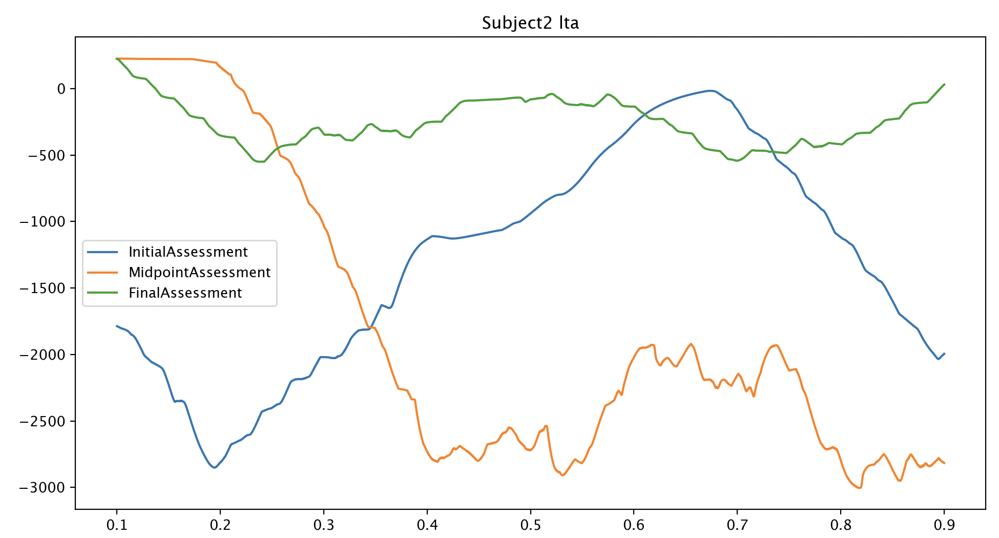
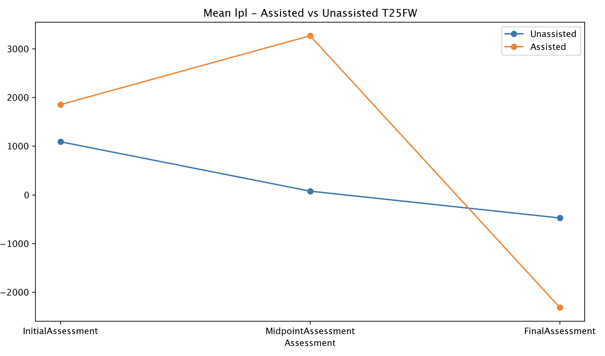

# Multiple Sclerosis Gait Augmentation With The Cionic Neural Sleeve

## Notes on Running Code
- Due to the sourcing of this dataset coming from Cionic itself, the sourcing code only works with their internal repository. The sourcing file works as a command line tool and a secret access token provided by Cionic is required to actual source the data. Thus, the file in this repository will not actually work. However, I have included the code to show an example of the steps I used to actually source this data.

## Step to run eda.py:
1. Set-up and activate a virtual environment:
Mac OS/Linux:
```
python3 -m venv venv
source venv/bin/activate
```
Windows:
```
python -m venv venv
venv\Scripts\activate
```
### 2. Install the required dependencies
```
pip install -r requirements.txt
```
### 3. Run the EDA Pipeline
```
python eda.py
```
- Notes: The EDA file right now just runs the function 'plot_emg.' However, for actual EDA, this was modified depending on what aspect of the data was being analyzed at the time.

## Executive Summary
### Motivation
Multiple Sclerosis (MS) is an autoimmune disease of the central nervous system. It is the leading cause of non-traumatic neurological disability in young adults and affects over 2 million people worldwide ([Hone et. al](https://pmc.ncbi.nlm.nih.gov/articles/PMC8860835/)). There are a wealth of early on-set detection methods including lumbar punctures, MRIs, etc. One of the earliest signs of the on-set of multiple sclerosis is trouble walking and difficulty with balance and the disease can further lead into spasticity and paralysis. I want to curate a dataset that consists of data to help predict/warn of the early on-set of multiple sclerosis based on sensor data relating to muscle twitches and walking stability.

While MS is not fatal in and of itself, the health complications that can arise from the nature of the disease can lead to death. The earlier you can treat it the better the likelihood of prolonging the severity of MS. On a personal level, my father passed away due to MS when I was 11. When they first tested him for the disease using a lumbar puncture, the test came back negative and by the time he was correctly diagnosed his ability to walk had already begun to deteriorate. Having other means of analyzing MS could have potentially helped my father, and I hope to provide someone else with that opportunity.

### Potential Applications

This time series data is very promising for the scientific community in studying multiple sclerosis. This data can be used to analyze disease progression by looking at gait metrics and could potentially be used to derive predictive gait analysis. Perhaps with further analysis by the scientific community at large there is further potential in developing solutions for the benefit of the multiple sclerosis community. Some limitations to this dataset is that, given this was a pilot study conducted with only 6 participants, it may not be representative of the MS community as a whole. However, this dataset still contains valuable information, and its applications have the potential to yield impactful findings.

## Data Description
### Methods & Technical Implementation
The FES device used in this study was the Cionic neural sleeve. This sleeve contains multiple FES gel electrodes which were located on the anterolateral region of the lower leg. Frequencies and pulse widths are programmable and each electrode’s current intensity is able to be configured independently. The data collected from the sleeve include inertial measurement units that were placed on the thigh and shank and can be used to reconstruct the leg’s spatial orientation, and EMGs. Patients were instructed to perform two 6 minute walk tests (one unstimulated and one stimulated), and a timed 25-foot walk test (T25FW). For the 6-minute walk test, subjects were instructed to walk as far as possible for 6 minutes up and down a pathway, pivoting to turn at the end of each lap. Timing began when the participant stepped over the start line and distance traveled was recorded. If they were unable to complete 6 minutes, they were instructed to stop. Use of a walking aid and standing rests was permitted. The T25FW was used to measure gait speed for a timed 25-foot walk. Subjects were permitted to use an assistive device to complete this test as long as it was consistent across visits. Participants in this pilot study were randomized into one of two groups: A or B. Group A started the trial wearing the Actigraph and received stimulation assisted walking from the Neural Sleeve, while group B only wore the Actigraph while walking to start. After 6 weeks, participants switched groups.

### Content Description

This dataset consists of time-series data which represent different tests performed during the pilot study. Folders are split into each subject by participant number. In each subject folder there is a subfolder for their initial, midpoint and final assessments and within each of those there is a 6MWT (6 minute walk test) subfolder and a T25FW (timed 25 foot walk) subfolder. Example Structure:

```
SubjectX/
├── InitialAssessment/
│   ├── 6MWT/
│   └── T25FW/
├── MidpointAssessment/
│   ├── 6MWT/
│   └── T25FW/
├── FinalAssessment/
│   ├── 6MWT/
│   └── T25FW/
```

Each CSV is a record of either EMG or IMU data for one participant performing one test on either their initial, midpoint or final assessment. They follow the following naming structure: (Left or Right Leg)_(Sensor Placement) _(Sensor Type) _(Test (Optional) Number). An Example: r_shank_imu_standby01 would be the CSV corresponding to an IMU sensor placed on the right shank and it is the recording of the 1st standby test. The number for filenames will only appear for standby tests since that is the only one that was repeated in a single visit (there was a standby period before the unstimulated and stimulated walks in the timed 25 foot walk). 

For EMG data, the measurements are labeled differently for the left and right legs. For the right, the CSV will have:
- elapsed_s: The elapsed time in seconds
- rvl: Right Vastus Lateralis
- rrf: Right Rectus Femoris
- rta: Right Tibialis Anterior
- rpl: Right Peroneus Longus
- rgl: Right Gastroc Lateral
- rhm: Right Hamstring Medial
- rgm: Right Gastroc Medial
- rhl: Right Hamstring Lateral

The left will have:
- elapsed_s: The elapsed time in seconds
- lhl: Left  Hamstring Lateral 
- lhm: Left Hamstring Medial 
- lgm: Left Gastroc Medial 
- lgl: Left Gastroc Lateral 
- lpl: Left Peroneus Longus
- lrf: Left Rectus Femoris
- lta: Left Tibialis Anterior
- lvl: Left Vastus Lateralis

IMU measurements are represented as quaternions following the function q = w + xi + yj + zk and each IMU CSV has the following columns:
- elapsed_s: The elapsed time in seconds
- i: The value representing the i-coordinate at time s
- j: The value representing the j-coordinate at time s
- k: The value representing the k-coordinate at time s
- real: The scalar component of the quaternion (w) at time s 

The SubjectInformation CSV contains relevant information for each participant of the pilot study. It has the following columns:
- ID: The participant’s anonymized ID alias
- Group: If they were initially in group A or group be in the study. 0 = Group B (aka only actigraph first), and 1 = Group A (both actigraph and neural sleeve first)
- Gender: 0 = Female, 1 = Male
- Age: The age of each participant
- YrsDiag_MS: The number of years since a participant was first diagnosed with MS
- Impaired_Limb: 0 = Left, 1 = Right

## Power Analysis

Since this dataset was directly sourced from a pilot study conducted by Cionic, the sample size was entirely dependent on the size of the study conducted. This pilot study consisted of 6 patients, 2 male and 4 female. Their ages ranged between 46-64 and they had been living with multiple sclerosis between 7-22 years. For each participant, only their most impacted leg was tested in the study. Each participant went through an initial assessment, a midpoint assessment and a final assessment. All participants were assigned a hip-worn Actigraph activity monitor, a Cionic Neural Sleeve (an adaptive, current steering FES brace) to be worn on the most impacted leg and prescribed a home-based intervention of 15 minutes of walking for 5 days a week for 12 weeks. The Actigraph was worn for the duration of the 12-week walking intervention, while the sleeve was only worn for 6 weeks of the study.

## Exploratory Data Analysis

For EDA, Cionic has in their research portal a notebook to extract and analyze gait data for each assessment, and each test (6-minute walk test or timed 25-foot walk). This results in graphs that look like the following: 

1. There are graphs to view events like heel strike and toe-off in a recording cycle:


2. We can analyze a specific part of the leg, such as the knee:


3. For each angle, we can view that angle broken down. In this case it's knee flexion:


4. And we can see those angles in relation to each other:


However, what was not present in their notebooks was the ability to analyze stimulated vs unstimulated tests and to break that down by subject. So, I created my own EDA pipeline to perform that analysis.

1. I created a function that is able to compare all subjects (with disabilities in the same leg) for a specific assessment:


2. We can now also view how a subject progressed over each assessment (looking at assisted tests below):


3. I also wanted to compare the means for all subjects over the initial and final assessments:


Results:

When inspecting the mean values across tests, I found that unassisted tests had much less variability. But, something I didn't expect to see was that for many of the different EMGs, the assisted vs unassisted graphs appear somewhat like mirrors of each other. I would mainly expect smaller shifts in the unassisted graph, but not an almost identical reflection of each other. Another interesting find is that for the participants with a left leg impairment, for 6/8 of their EMG readings, the midpoint assessment was their most extreme for assisted recordings. I initially thought that the initial assessment would have the most extreme values, but perhaps they were able to withstand more stimulation in the midpoint exam. For the right leg impaired participants, the unassisted tests seemed to have a majority of the most extreme values (a stark difference from the left leg impaired individuals). However, there are only 2 participants with right-leg impairements as opposed to 4 with left-leg so this could skew some of that data.

When looking at the time-series themselves for each subject, it was very difficult to find relationships between the time-series and the subjects. I looked at both the 25-foot walk and the 6-minute walk test and found that there weren't many trends that followed. I found that different participants were more extreme than others depending on which electrode was being recorded, but it wasn't consistently one participant. That is, each subject had at least one electrode in which they had the most extreme values. But, that was also not consistent between assessments (i.e. There was not the case where a participant was consistently worse than the others between the initial, midpoint and final assessments). The 25-foot walk test seemed to have more extreme values and variation compared to the 6-minute walk test. I also tried analyzing the data to see if there were trends in things like gender, time since they've been diagnosed with MS, or if they were in group A or B, but have not found much correlation to that and the graphs. 

## Link To Publicly Available Dataset

## Ethics Statement

This pilot study adheres to the highest ethical standards, and measures were placed to ensure integrity, respect and responsibility throughout the study. Participation in the pilot study was voluntary and each participant provided written informed consent. In order to prioritize patients’ privacy and confidentiality, all identifying information has been anonymized. Study protocols have been approved by the Cleveland State University IRB. This clinical trial is listed under the name “Impact of the Cionic Neural Sleeve on Mobility in Multiple Sclerosis“ and has trial ID: NCT05964829.

## Open-Source License

[Open Data Commons Open Database License v1.0](https://physionet.org/about/licenses/open-data-commons-open-database-license-v10/)