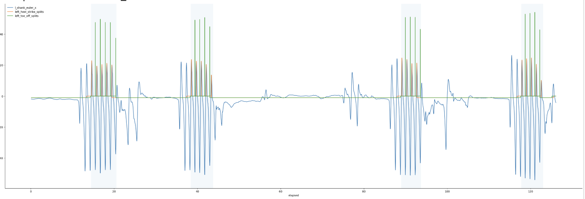
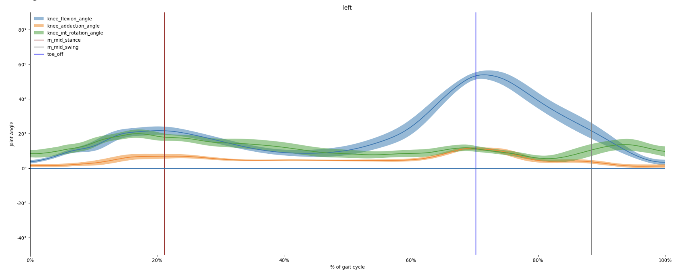
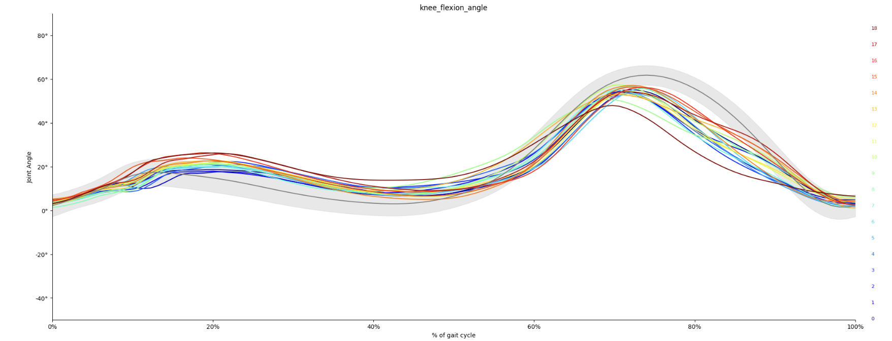
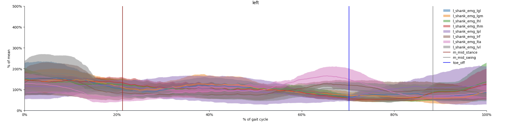
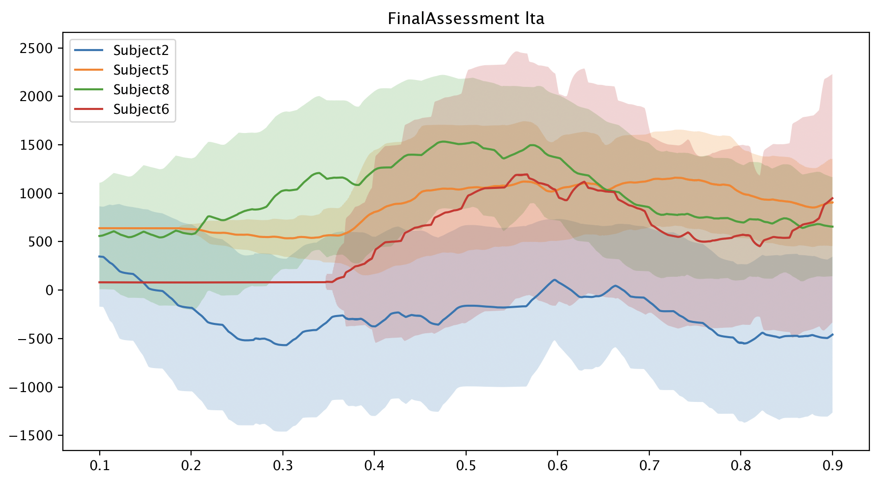
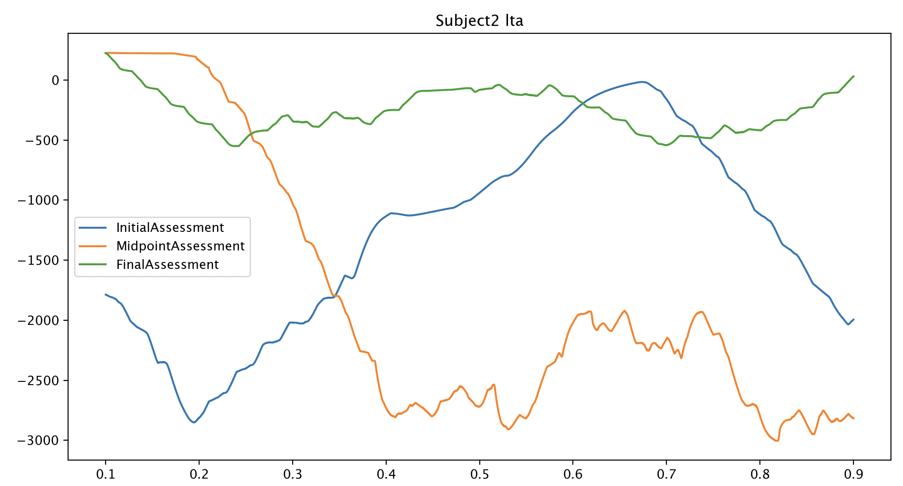
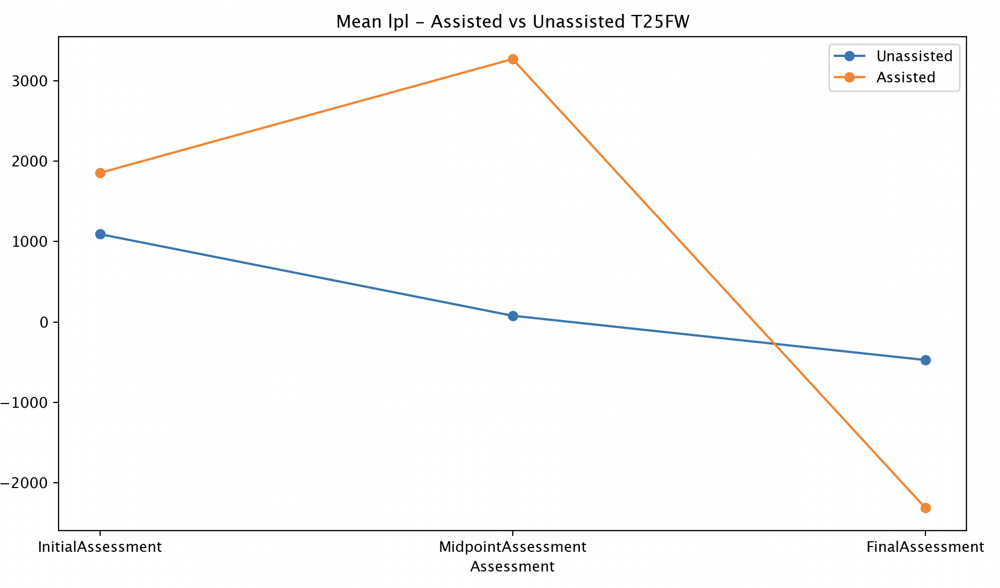

# Multiple Sclerosis Gait Augmentation With The Cionic Neural Sleeve

## Notes on Running Code
- Due to the sourcing of this dataset coming from Cionic itself, the code used to source the data is proprietary information. Thus, sourcing code has been omitted from this repository.

## Checkout The Streamlit App

https://ms-sensor-classification.streamlit.app/

## Steps to run eda.py:
1. Set-up and activate a virtual environment:
Mac OS/Linux:
```
python3 -m venv venv
source venv/bin/activate
```
Windows:
```
python -m venv venv
venv\Scripts\activate
```
### 2. Install the required dependencies
```
% pip install -e .
```
### 3. Run Data Processing and Model Training
```
train-models
```
- Notes: After training, the models and scaler should be saved to the models directory

## File Structure

```
multiple-sclerosis-research/
├── data/
│   ├── img/                        # images displayed in this README
│   ├── raw/                        # raw sensor data (both EMG and IMU) for each collection
│   └── processed/                  # processed data files
├── notebooks/                      # Jupyter scratch notebooks for exploration and analysis
├── scripts/                        # Source code for the project
│   ├── __init__.py                 # Makes scripts a Python package
│   ├── data_preprocessing.py       # Code to load and preprocess data
│   ├── deep_learning_model.py      # Script to train the deep learning model
│   ├── naive_model.py              # Script to train the naive model
│   ├── traditional_model.py        # Script to train the traditional model
│   └── train_models.py             # Script to run data preprocessing and train all models 
├── models/                         # Trained and serialized models
│   ├── ms_dl_model.pth             # Saved deep learning model
│   ├── ms_traditional_model.pkl    # Saved traditional model
│   └── scaler.pkl                  # Saved scaler that was used during training
├── .gitignore                      # Files/folders to ignore in Git
├── app.py                          # File which sets up the frontend for the streamlit application
├── requirements.txt                # List of dependencies
├── README.md                       # Project overview and usage instructions
└── setup.py                        # Configures the packaging and distribution of the project
```

## Executive Summary
### Motivation
Multiple Sclerosis (MS) is an autoimmune disease of the central nervous system. It is the leading cause of non-traumatic neurological disability in young adults and affects over 2 million people worldwide ([Hone et. al](https://pmc.ncbi.nlm.nih.gov/articles/PMC8860835/)). There are a wealth of early on-set detection methods including lumbar punctures, MRIs, etc. One of the earliest signs of the on-set of multiple sclerosis is trouble walking and difficulty with balance and the disease can further lead into spasticity and paralysis. I want to curate a dataset that consists of data to help predict/warn of the early on-set of multiple sclerosis based on sensor data relating to muscle twitches and walking stability.

While MS is not fatal in and of itself, the health complications that can arise from the nature of the disease can lead to death. The earlier you can treat it the better the likelihood of prolonging the severity of MS. On a personal level, my father passed away due to MS when I was 11. When they first tested him for the disease using a lumbar puncture, the test came back negative and by the time he was correctly diagnosed his ability to walk had already begun to deteriorate. Having other means of analyzing MS could have potentially helped my father, and I hope to provide someone else with that opportunity.

### Potential Applications

This time series data is very promising for the scientific community in studying multiple sclerosis. This data can be used to analyze disease progression by looking at gait metrics and could potentially be used to derive predictive gait analysis. The models created also provide a robust way of perhaps augmenting current detection methods that are less intrusive for individuals. Perhaps with further analysis by the scientific community at large there is further potential in developing solutions for the benefit of the multiple sclerosis community. 

### Limitations

Some limitations to both the dataset used and models created are that the studies used have a limited number of participants and may not be representative of the population as a whole. There are also other people who may have diseases like Parkinsons that also experience foot drop similar to those with MS. For a more holistic modeling approach, further analysis is needed to have to determine if these models can reliably detect multiple sclerosis as opposed to just deviations from the norm. 

## Data Description
### Methods & Technical Implementation
4 different studies were used as the dataset for the development of this model. They were all collected from an FES device known as the Cionic neural sleeve. This sleeve contains multiple FES gel electrodes which were located on the anterolateral region of the lower leg. Frequencies and pulse widths are programmable and each electrode’s current intensity is able to be configured independently. The raw data collected from the sleeve include inertial measurement units that were placed on the thigh and shank and can be used to reconstruct the leg’s spatial orientation, and EMGs. There were multiple different tests run for these different studies. For example in some, patients were instructed to perform two 6 minute walk tests (one unstimulated and one stimulated) and others a timed 25-foot walk test (T25FW). 

Data used for modeling consists of extracted statistical features combined with metadata provided by Cionic. The metadata was step duration which was the duration of each walking step as well as the affected leg side of the individual. The extracted statistical features were mean, median, std, min, max, skewness, kurtosis, 25th percentile, 75th percentile, peak-to-peak, total power, mean power, max power and dominant frequency. Each collection (1 walking test ran for one participant) was converted from having the shape [walking_steps, time_steps, num_sensors] to [walking_steps x time_steps, num_sensors]. Collections missing more than half of the sensor readings were dropped and the VL sensor was dropped since it was missing from many collections. In short, there were a total of 7 sensors analyzed. A rolling window was applied to each collection and only 4 walking steps were analyzed at a time for better generalizability across different tests and studies. 

### Content Description

This dataset consists of time-series data which represent different tests performed across multiple studies. Each file for both healthy and MS participants is labeled as follows. 

For IMU data: cionic_StudyName_CollectionID_LegSide_TestName.csv (e.g. cionic_Apollo_Adult_786_left_ankle_int_rotation.csv)

For EMG data: cionic_StudyName_CollectionID_LegSide_shank_emg_SensorName.csv (e.g. cionic_CSU_278_left_l_shank_emg_lgl.csv)

For EMG data, the measurements are labeled differently for the left and right legs. For the right, the CSV will be named with one of the following:

The right will have:
- rvl: Right Vastus Lateralis
- rrf: Right Rectus Femoris
- rta: Right Tibialis Anterior
- rpl: Right Peroneus Longus
- rgl: Right Gastroc Lateral
- rhm: Right Hamstring Medial
- rgm: Right Gastroc Medial
- rhl: Right Hamstring Lateral

The left will have:
- lhl: Left  Hamstring Lateral 
- lhm: Left Hamstring Medial 
- lgm: Left Gastroc Medial 
- lgl: Left Gastroc Lateral 
- lpl: Left Peroneus Longus
- lrf: Left Rectus Femoris
- lta: Left Tibialis Anterior
- lvl: Left Vastus Lateralis

All CSV files contain all steps walked by participants for that particular test where the start time of each step and the duration is denoted for each row. Each numbered column represents a recording in order. There were 100 recorded time steps for each walking step.

## Modeling Approaches

### Naive (A Mean Model):
- **Training**: Calculated the mean feature vector for healthy participants as well as the mean feature vector for participants known to have MS
- **Inference**: Calculate the mean feature vector for the collection being tested and calculate the euclidean distance of that vector from the 2 vectors we trained our model on. If it’s closer to MS we predict MS otherwise we predict Healthy
- **Other Models Evaluated**: A mean model based on the labels instead of the feature set

### Traditional:
- Trained a BaggingClassifier which consists of 5 separate GradientBoostingClassifiers using bootstrap sampling on 90% of the training data. The GB classifier has n_estimators=100, learning rate of 0.2, max depth of 3 and a min_samples_split of 2
- **Other Models Evaluated**: Random Forests, Other Boosting models (e.g. XGBoost), other ensemble methods

### Deep Learning:
- A 4-layer MLP model trained on the same statistical data we used for the naive and tradtional approaches
Uses batch norm and dropout, it is trained over 50 epochs and is trained to minimize the binary cross-entropy loss
- **Other Models Evaluated**: LSTMs, CNNs, Time-Series Transformers and different MLPs

## Results

### Naive Model
- Accuracy: 88.07%
- Precision: 96.97%
- Recall: 73.06%
- F1-Score: 83.33%

### Traditional Model
- Accuracy: 97.95%
- Precision: 99.84%
- Recall: 95.13%
- F1-Score: 97.43%

### Deep Learning Model
- Accuracy: 82.24%
- Precision: 92.26%
- Recall: 61.64%
- F1-Score: 73.91%

## Previous Efforts & Literature

### Medical Testing Efforts:
- MRI testing
- Lumbar Punctures
- Blood Tests
- Eye Exams
- Disease-modifying treatments to target inflammation
- Steroids and plasma exchange

### ML Efforts:
- [Using grey matter to classify different types of MS](https://pmc.ncbi.nlm.nih.gov/articles/PMC9608344/)
- [Classifying different types of MS by analyzing CNS regional atrophy on MRI data](https://pmc.ncbi.nlm.nih.gov/articles/PMC8090784/)
- [Using a CNN trained on MRI data to differentiate types of multiple sclerosis from non-specific white matter changes](https://pubmed.ncbi.nlm.nih.gov/38183693/)

## Evaluation Process & Metric Selection:

### Evaluation Process
- Stratified K-fold cross validation during training before finally training on the full training set 
- Hold-out test set during the entire training process which was only used at the end to evaluate the real-world performance of the model
- Entire collections were evaluated at a time since those correspond to one walking test for a single individual

### Metrics:
- Due to the potentially fatal results with classifying someone who truly has MS as being healthy, the primary metric chosen was recall
- However all 4 (accuracy, precision, recall and F1) were evaluated

## Exploratory Data Analysis

For EDA, Cionic has in their research portal a notebook to extract and analyze gait data for each assessment, and each test (6-minute walk test or timed 25-foot walk). This results in graphs that look like the following: 

1. There are graphs to view events like heel strike and toe-off in a recording cycle:


2. We can analyze a specific part of the leg, such as the knee:


3. For each angle, we can view that angle broken down. In this case it's knee flexion:


4. And we can see those angles in relation to each other:


However, what was not present in their notebooks was the ability to analyze stimulated vs unstimulated tests and to break that down by subject. So, I created my own EDA pipeline to perform that analysis.

1. I created a function that is able to compare all subjects (with disabilities in the same leg) for a specific assessment:


2. We can now also view how a subject progressed over each assessment (looking at assisted tests below):


3. I also wanted to compare the means for all subjects over the initial and final assessments:


Results:

When inspecting the mean values across tests, I found that unassisted tests had much less variability. But, something I didn't expect to see was that for many of the different EMGs, the assisted vs unassisted graphs appear somewhat like mirrors of each other. I would mainly expect smaller shifts in the unassisted graph, but not an almost identical reflection of each other. Another interesting find is that for the participants with a left leg impairment, for 6/8 of their EMG readings, the midpoint assessment was their most extreme for assisted recordings. I initially thought that the initial assessment would have the most extreme values, but perhaps they were able to withstand more stimulation in the midpoint exam. For the right leg impaired participants, the unassisted tests seemed to have a majority of the most extreme values (a stark difference from the left leg impaired individuals). However, there are only 2 participants with right-leg impairements as opposed to 4 with left-leg so this could skew some of that data.

When looking at the time-series themselves for each subject, it was very difficult to find relationships between the time-series and the subjects. I looked at both the 25-foot walk and the 6-minute walk test and found that there weren't many trends that followed. I found that different participants were more extreme than others depending on which electrode was being recorded, but it wasn't consistently one participant. That is, each subject had at least one electrode in which they had the most extreme values. But, that was also not consistent between assessments (i.e. There was not the case where a participant was consistently worse than the others between the initial, midpoint and final assessments). The 25-foot walk test seemed to have more extreme values and variation compared to the 6-minute walk test.

## Ethics Statement

Each of these studies have adhered to the highest ethical standards, and measures were placed to ensure integrity, respect and responsibility throughout each study. Participation in these studies was voluntary and each participant provided written informed consent. In order to prioritize patients’ privacy and confidentiality, all identifying information has been anonymized. Study protocols have been approved by the Cleveland State University IRB. This clinical trial is listed under the name “Impact of the Cionic Neural Sleeve on Mobility in Multiple Sclerosis“ and has trial ID: NCT05964829.

## Open-Source License

[Creative Commons Attribution 4.0 International Public License](https://physionet.org/about/licenses/creative-commons-attribution-40-international-public-license/)